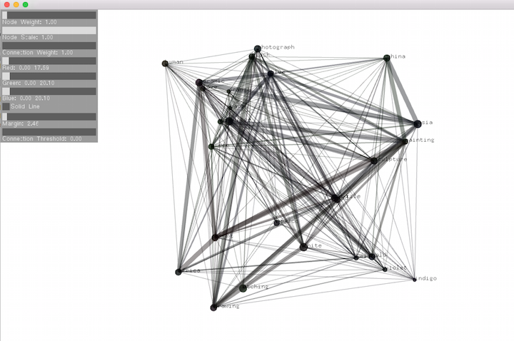
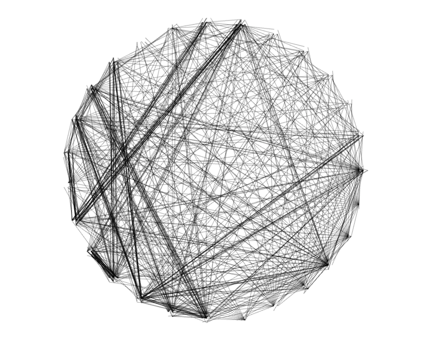

metaMethods
=================

_____________________________________________

Set Theory is a branch of mathematics that studies sets or the collection of objects. This project, metaMethods, is concerned with making sense of Big Data by applying set theory to the cataloging and the creating of collections of information. When the world is viewed as a massive network, everything can be viewed as a data point, but also, when that data is collected, it becomes and can be viewed as part of a set. And what is inherent in any data point is the metadata that defines it and links it to subsets and supersets. 

metaMethods is a research endeavor in algorithmic art using mathematical modeling of data in the programming language C++ in OpenFrameworks (OF). Using the Metropolitan Museum of Art’s (the Met’s) digital archive as a data set, the project also explores the idea of the museum as a medium and the potential for museum objects, collected together as a set, to be seen as a standalone body of work.

This project was made using the openFrameworks add-on [ofxMetAPI](https://github.com/reginaflores/ofxMetAPI)

